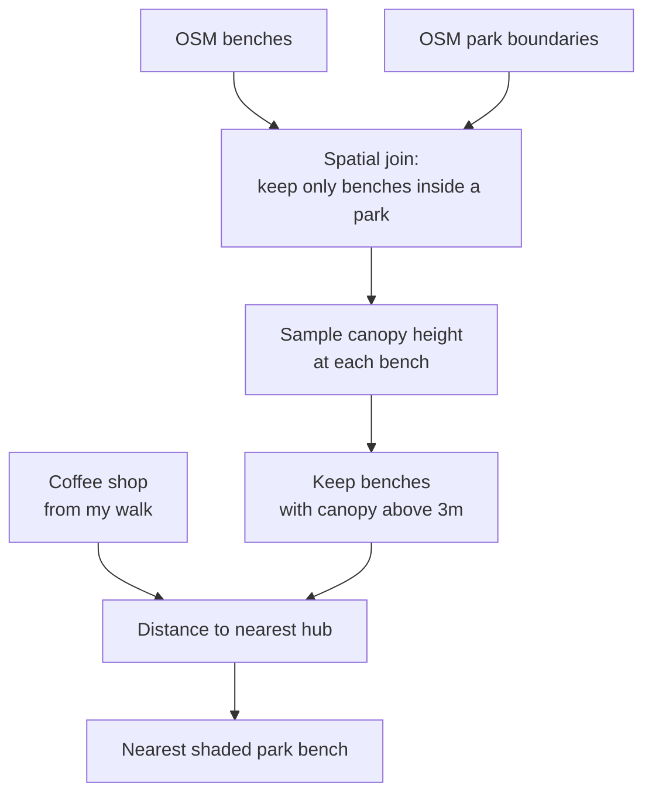

Assignment 02: My Local Dataset
The Narrative

My local dataset traces a walk I make regularly through the West Village and into Chelsea. It starts at my front door on 6th Avenue, down 14th Street, stops at a coffee shop, cuts through Jackson Square Park, and ends at the Chelsea entrance of the High Line. 

Drawing it made me notice that I stop in different ways at different points. On 14th Street I stop because that's where one of my local cafes are. In Jackson Square I stop because I want to either eat my take out food or drink my coffee - off the city streets. The park is small and tucked in behind trees, and it works as a break from the street rather than a pause inside it.

That difference is what this dataset is about. Not whether there is somewhere to sit, but whether sitting there is any good.

----------------------------------------------------------------

Proposed Related Dataset

OpenStreetMap benches (amenity=bench) https://wiki.openstreetmap.org/wiki/Tag:amenity%3Dbench

I chose OSM over the city's DOT Seating Locations dataset for one reason. DOT only records seating it installed on sidewalks and at bus stops, so benches inside parks are simply absent from it. Since my whole argument is about park benches, a source that cannot see them is the wrong source. OSM contributors map benches wherever they are.

I will pull the data through Overpass Turbo, which exports to GeoJSON: https://overpass-turbo.eu/

[out:json][timeout:25];
{{geocodeArea:"Manhattan"}}->.searchArea;
node["amenity"="bench"](area.searchArea);
out geom;

I will also need:

Cafes either from OSM the same way (amenity=cafe), or from NYC Open Data's restaurant inspection dataset filtered to Café/Coffee/Tea.

Shade: Meta / WRI Global Canopy Height https://datasets.wri.org/datasets/meta-tree-canopy-height

A 1m resolution raster of tree canopy height. Sampling it at each bench point tells me whether that bench sits under a canopy or out in the open.

The Why:
A bench and a cafe are both somewhere to sit and have a coffee. Cafes may offer outside seating but it's on a busy NYC street; this proposed workflow will look at the closest NYC Park bench and ideally will include tree canopy data to ensure the bench is shaded: particularly in the summer sun.

Steps:
1. Filter to park benches. Spatial join the bench points against the park polygons and keep only the ones that fall inside.
2. Sample shade. Use Raster > Sample Raster Values in QGIS to read the canopy height at each surviving bench point.
3. Set a threshold. Keep benches where canopy height is above roughly 3m, which is enough to actually cast shade over a seat.
4. Reproject. Convert to EPSG:2263 so distances come out in feet.
5. Find the nearest. Run Distance to Nearest Hub with the coffee shop as the input and the shaded park benches as the hubs.

Diagram Workflow:

