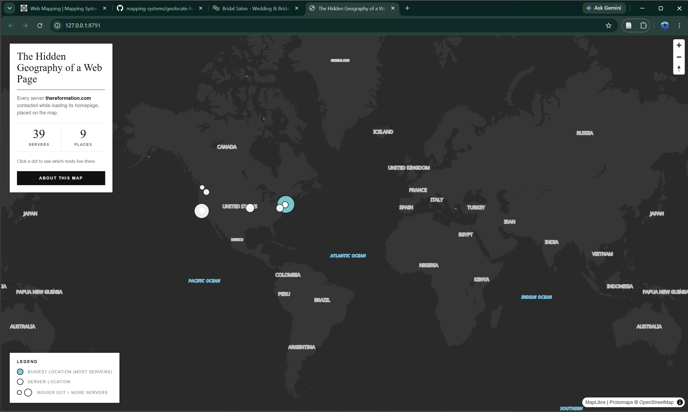
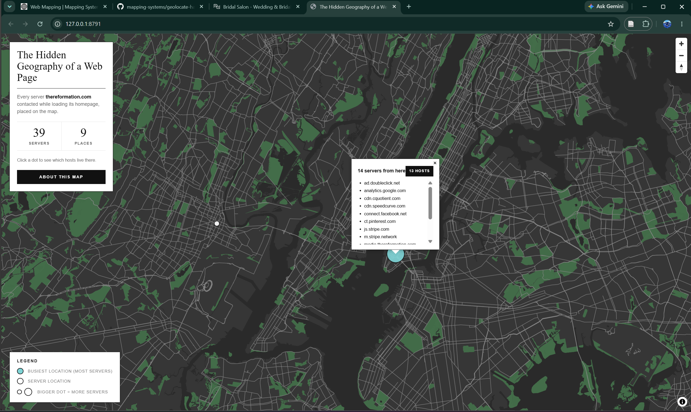

Assignment 04: Web Mapping (Part 1)

Website mapped: https://www.thereformation.com/

## The Narrative

The busiest server from Reformation were actually third party ads or analytics (this involved Stripe, Meta, Google Ads) in New York City, not Reformation's own server.


## What I mapped

I recorded a single page load of the Reformation homepage as a HAR file and
plotted every server my browser talked to while the page assembled itself. From
one page load:

- **133** requests with a server IP
- **39** distinct server IP addresses
- **9** geographic locations

The busiest location is highlighted in light aqua. It is not Reformation's own store server but a cluster of third-party services (Stripe, Meta/Facebook, Pinterest, Google Ads/DoubleClick, Cloudinary) resolving to New York.

## Method

Following the assignment steps:

1. Cloned `mapping-systems/geolocate-har-file` and installed `requests` + `folium`.
2. In Chrome, opened the Network tab, cleared the log, reloaded
   thereformation.com, and exported the HAR into `inputs/`.
3. Ran `python scrape_har_locations.py`, which read the HAR, extracted each
   request's server IP, geolocated it with ipinfo.io, and wrote a GeoJSON plus an
   HTML preview map.
4. Built an interactive MapLibre web map that loads the GeoJSON as a layer. It
   aggregates IPs that share a location into one dot sized by how many servers
   sit there, and lists the hosts when you click a dot. The panels follow
   Reformation's own aesthetic — white ground, black text, Times serif
   headlines — with a single light-aqua accent on the busiest location.

## Submission

**1. Screenshot of the web map**





**2. GeoJSON generated by the script**

[04-ip_locations.geojson](04-ip_locations.geojson)

**3. Web map files (launchable)**

Folder: [04-web-map/](04-web-map/) — `index.html`, `style.css`, `main.js`,
`ip_locations.geojson`, `MapBaseV2.json`.


To run locally, from the `04-web-map/` folder:

```bash
python -m http.server 8791
```

then open http://127.0.0.1:8791/ .
